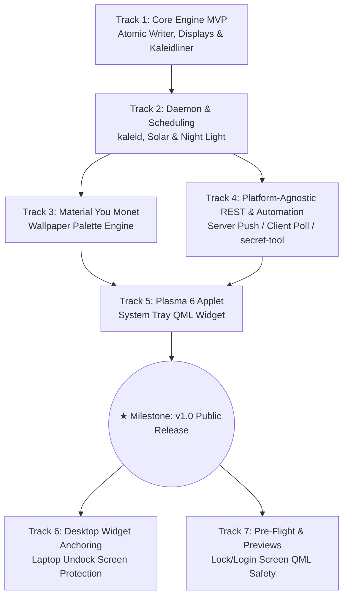

# Kaleidos Architecture & Multi-Track Roadmap

## Project Vision & Goal
To **atomically harmonize fragmented desktop configurations into unified, zero-flicker system presets**.

This roadmap directly translates the needs and pain points of our three target user personas into an orderly, iterative engineering plan with explicit acceptance criteria and concrete deliverables for each track.

---

## User Personas Mapping

| Persona | Archetype | Primary Focus & Pain Points |
| :--- | :--- | :--- |
| **Persona 1: The SE.RA.PH Architect** (センパイ) | Advanced Power Optimizer | Multi-monitor undocking widget scramble; QML lock/login blind-firing; daemon crash interference; Home Assistant / Node-RED ambient automation. |
| **Persona 2: The Rice Enthusiast** | Ordinary Competent User | Wallpapers desynchronized with color scheme; Kvantum/Aurorae/Splash reset bugs; seamless light/dark transitions; needs GUI tray. |
| **Persona 3: The Converted Windows Migrant** | Baseline / Incapable User | Brittle rices; black screen lockouts; missing system tray UI; needs "just works" one-click preset switching. |

---

## Track Breakdown & Milestones

---

### Track 1: Core Engine, Theming Taxonomy & Linter (MVP)
- **Status:** Complete (Ready for Review)
- **Target Personas:** All (Architect, Rice Enthusiast, Windows Migrant)
- **Scope & Objectives:**
  - Establish single source of truth configuration in TOML.
  - Native inline multi-monitor KScreen layouts via `kscreen-doctor` without JSON intermediate files.
  - Non-destructive atomic multi-config writer across 7 KDE configuration files (`kwinrc`, `ksplashrc`, `kdeglobals`, `plasmarc`, `kcminputrc`, `kscreenlockerrc`, `kvantum.kvconfig`).
  - Strict validator (`kaleidliner`) and full desktop state snapshot (`kaleidos clone`).
  - Single coordinator execution to eliminate multiple daemons crashing `plasmashell`.
- **Deliverables:**
  - `src/kaleidos/config.py`: Complete Pydantic models for full theming taxonomy and native displays.
  - `src/kaleidos/plasma_writer.py`: Atomic temporary-file INI writer preserving unmanaged keys and comments.
  - `src/kaleidos/display.py`: Native direct `kscreen-doctor` translator.
  - `src/kaleidos/reloader.py`: Atomic KWin D-Bus reconfigure invocation.
  - `src/kaleidos/clone.py`: Live desktop snapshot generator.
  - `src/kaleidos/linter.py`: Strict validation CLI (`kaleidliner`).
  - `src/kaleidos/cli.py`: Click CLI (`kaleidos switch`, `kaleidos list`, `kaleidos status`, `kaleidos clone`).
  - Full automated test suite (22 unit tests passing).
- **Acceptance Criteria:**
  - [x] Preset switching executes in a single pass without flickering or intermediate JSON generation.
  - [x] Custom splash screens in `ksplashrc` are locked and never wiped back to stock Breeze.
  - [x] Live desktop state is captured into a valid, reproducible TOML preset via `kaleidos clone <name>`.
  - [x] `kaleidliner` rejects config syntax errors, detects missing theme pairings, and warns on root-required keys.
  - [x] 100% test pass rate across core modules.

---

### Track 2: Background Daemon & Solar/Night Light Scheduling (`kaleid`)
- **Status:** Pending Review / Up Next
- **Target Personas:** センパイ (Architect) & Rice Enthusiast
- **Scope & Objectives:**
  - Implement unprivileged background service `kaleid` replacing Koi.
  - Solar ephemeris calculation for astronomical sunrise, golden hour, and sunset based on user lat/long.
  - Reactive D-Bus signal listener subscribing to KWin Night Light state changes (`org.kde.KWin.NightLight`).
  - Dynamic display hotplug event handler (reacting to monitor connection/disconnection).
  - Systemd user service generator (`kaleid.service`).
- **Deliverables:**
  - `src/kaleidos/daemon.py`: Full event-driven async daemon.
  - `src/kaleidos/solar.py`: Pure-Python astronomical solar calculator (no heavy C dependencies).
  - `src/kaleidos/dbus_listener.py`: KWin Night Light D-Bus monitor.
  - `systemd/kaleid.service`: Systemd user service unit template.
- **Acceptance Criteria:**
  - [ ] Automatically switches to designated day/night preset when sunrise/sunset occurs or Night Light toggles.
  - [ ] Debounces rapid hotplug events to avoid race conditions.
  - [ ] Idempotent execution: no config writes or D-Bus reload triggered if the target preset is already active.
  - [ ] Memory footprint under 30MB RSS when idle; zero CPU burn between scheduled events.

---

### Track 3: Wallpaper Monet Dynamic Palette Engine (`material_you_monet`)
- **Status:** Planned
- **Target Personas:** Rice Enthusiast & Converted Windows Migrant
- **Scope & Objectives:**
  - Replace `kde-material-you-colors` with native in-engine Material Design 3 Monet palette extraction.
  - Sample current desktop wallpaper, extract primary harmonic colors, and generate WCAG-compliant light and dark palettes.
  - Dynamically generate and patch KDE Color Scheme files (`~/.local/share/color-schemes/KaleidosDynamic.colors`).
- **Deliverables:**
  - `src/kaleidos/monet.py`: Color extraction engine from wallpaper image files.
  - `src/kaleidos/palette_writer.py`: KDE `.colors` INI generator with proper tonal palettes.
  - CLI flag: `kaleidos switch --from-wallpaper <path>`.
- **Acceptance Criteria:**
  - [ ] Extracts harmonic color scheme within < 500ms for typical 4K wallpapers.
  - [ ] Generates valid Plasma 6 color scheme with proper contrast ratios (meeting WCAG AA standards for window text).
  - [ ] Integrates into TOML preset syntax via `color_scheme = "auto:monet"`.

---

### Track 4: Platform-Agnostic REST & Ambient Automation (`ambient_automation`)
- **Status:** Planned (Swapped before Applet for lower complexity & backend readiness)
- **Target Personas:** センパイ (Architect)
- **Scope & Objectives:**
  - Provide a platform-agnostic automation bridge supporting Home Assistant, Node-RED, n8n, or any REST-compatible service.
  - Dual communication architectures:
    1. **Server Listener Mode (Event-Driven / Preferred for Workstations & Home Laptops):** `kaleid` runs a lightweight local HTTP listener. Automation systems push events (e.g. `POST /api/v1/switch {"preset": "Night"}`) directly to the desktop when home states change, eliminating polling overhead.
    2. **Client Mode (Polling / Outbound Push):** For users with firewall constraints or security preferences avoiding open local ports, `kaleid` can periodically poll external entity states or make outbound webhook calls when presets switch locally.
  - Customizable request header and payload templates (e.g. `{preset}`, `{mode}`, `{timestamp}`).
  - Dynamic token / credential retrieval via system `secret-tool` (Freedesktop Secret Service) to eliminate plaintext secrets in `config.toml`.
- **Deliverables:**
  - `src/kaleidos/automation/server.py`: Async HTTP server in `kaleid` with bearer token authentication.
  - `src/kaleidos/automation/client.py`: Outbound REST client and polling worker.
  - `src/kaleidos/automation/secrets.py`: Integration with `secret-tool` and Secret Service API.
  - `src/kaleidos/automation/template.py`: Header and JSON payload template renderer.
  - Configuration section in `config.toml` (`[automation]`).
- **Acceptance Criteria:**
  - [ ] External HTTP POST `{"preset": "<name>"}` securely triggers atomic preset switch within < 200ms.
  - [ ] Outbound webhooks and polling execute asynchronously without blocking daemon scheduling or desktop rendering.
  - [ ] Token lookups successfully resolve dynamically from `secret-tool` without persisting plaintext credentials in config.
  - [ ] User can customize headers and payload formats to interface seamlessly with Home Assistant, Node-RED, or n8n.
  - [ ] Both Server Listener and Client Polling modes can be independently toggled on/off.

---

### Track 5: Native Plasma 6 System Tray Applet (`plasma6_applet`)
- **Status:** Planned (★ Gate for Version 1.0 Public Release)
- **Target Personas:** Converted Windows Migrant & Rice Enthusiast
- **Scope & Objectives:**
  - Deliver a native Qt Quick / QML applet (`org.kde.kaleidos`) for the KDE Plasma 6 panel / system tray.
  - Provide an intuitive GUI for one-click preset switching, manual light/dark mode toggles, active automation status, and upcoming solar transition countdown.
  - Communicate with `kaleid` via high-level D-Bus (`org.kde.Kaleidos`).
  - Enable non-technical users to adopt Kaleidos with zero CLI friction.
- **Deliverables:**
  - `plasmoid/`: Complete Plasma 6 applet package (`metadata.json`, `CompactRepresentation.qml`, `FullRepresentation.qml`).
  - Applet installer / uninstaller command: `kaleidos install-applet`.
  - D-Bus interface definitions in `kaleid` (`org.kde.Kaleidos`).
  - Package distribution metadata for KDE Store and Arch PKGBUILD.
- **Acceptance Criteria:**
  - [ ] Applet appears seamlessly in Plasma 6 system tray with adaptive icon matching current mode.
  - [ ] Clicking a preset applies it instantly with visual feedback and zero UI freeze.
  - [ ] Follows native Kirigami design patterns and respects active system styling.
  - [ ] Shows current active preset, upcoming solar transition, and connected automation status.
  - [ ] **Release Gate v1.0:** Upon completion of this track, Kaleidos v1.0 is published for user feedback!

---

### Track 6: Multi-Monitor Layout & Desktop Widget Anchoring (`desktop_widget_anchoring`)
- **Status:** Post-v1 Optimization
- **Target Personas:** センパイ (Architect)
- **Scope & Objectives:**
  - Solve the laptop undocking pain point: prevent desktop widgets, applets, and Plasma panels from scrambling across virtual screens when unplugging external displays.
  - Track and snapshot `~/.config/plasma-org.kde.plasma.desktop-appletsrc` configurations per display setup signature.
  - Restore panels and applet geometry atomically during display configuration transitions.
- **Deliverables:**
  - `src/kaleidos/widget_anchor.py`: Applet configuration parser and geometry snapshot/restore engine.
  - Display signature generator (SHA-256 fingerprint of connected monitor IDs).
  - Integration with `kaleidos switch` and `kaleid` hotplug handler.
- **Acceptance Criteria:**
  - [ ] When unplugging external monitors, desktop panels and widgets on the internal screen maintain designated coordinates.
  - [ ] When re-plugging workstation monitors, panels and widgets automatically restore to external screens without manual rearrangement.
  - [ ] Automatic timestamped backup of `plasma-org.kde.plasma.desktop-appletsrc` created before any modification.

---

### Track 7: Pre-Flight Safety & Theme Previews (`preflight_and_previews`)
- **Status:** Post-v1 Hardening
- **Target Personas:** センパイ (Architect) & Converted Windows Migrant
- **Scope & Objectives:**
  - Solve the blind-firing pain point: prevent users from being locked out or encountering black screens due to missing QML imports or broken user-installed login/lock screen themes.
  - Implement isolated sandbox previews for Lock Screen and Login Greeter.
  - Validate QML components and assets before committing lock screen or login screen theme changes.
- **Deliverables:**
  - `src/kaleidos/preview.py`: Preview harness invoking `kscreenlocker_greet --testing` in a windowed sandbox.
  - `src/kaleidos/qml_validator.py`: Pre-flight asset validator inspecting QML imports and theme metadata.
  - CLI commands: `kaleidos preview --lockscreen <preset>` and `kaleidos test-theme <theme_name>`.
- **Acceptance Criteria:**
  - [ ] `kaleidos preview --lockscreen` spawns an isolated window showing the exact lock screen appearance without locking the live session.
  - [ ] Missing QML imports or corrupted theme packages are caught and rejected before applying, preventing black screen lockouts.
  - [ ] Clear diagnostics displayed identifying the missing dependency (e.g., missing Kirigami plugin or font).
